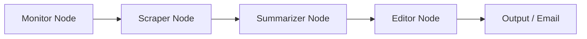

# AI Newsletter Agent

**An autonomous market intelligence agent designed to research, summarize, and publish journalistic-quality reports on the AI industry.**

This project demonstrates a production-grade **Agentic Workflow** using **LangGraph**, **Python**, and **LLMs (Claude 4.5)**. It automates the entire lifecycle of a newsletter: from monitoring targeted companies to scraping complex webpages, synthesizing technical information, and delivering a structured HTML email report.

## System Architecture

The system is architected as a stateful graph using **LangGraph**, where state is passed between specialized nodes. It employs an **AsyncIO** event loop to handle concurrent scraping and summarization tasks efficiently.



### Workflow Pipeline

1. **Monitor Node (The Analyst)**

- Queries the **Tavily API** for high-signal news regarding specific target companies (e.g., OpenAI, NVIDIA, DeepMind).
- Filters results based on publication date (configurable lookback), relevance score, and domain blacklists.
- Buckets results to ensure balanced coverage across targets.

2. **Scraper Node (The Engineer)**

- **Hybrid Strategy**: Attempts a lightweight static scrape (using `trafilatura`) first for speed. If blocked or empty, it escalates to a heavy-duty solution.
- **Stealth Browsing**: Uses **Playwright (Async)** with stealth injections to bypass anti-bot protections (Cloudflare, CAPTCHA challenges) and render JavaScript-heavy sites.
- **Concurrency**: Implements `asyncio.Semaphore` to manage resource load and rate limits while processing multiple URLs in parallel to increase processing speed.

3. **Summarizer Node (The Researcher)**

- Uses **Claude 4.5 Haiku** via **LangChain's structured output** (Pydantic) to map raw unstructured text into strict `ArticleSummary` objects.
- Extracts specific metadata: Technical specs, financial figures, key personnel, and relevance scores.
- **Concurrency**: Implements `asyncio.Semaphore` to manage resource load and rate limits while processing multiple URLs in parallel to increase processing speed.

4. **Editor Node (The Writer)**

- Aggregates summaries and groups them by entity.
- Uses **Claude 4.5 Sonnet** with a specific persona prompt to write a cohesive "Executive Summary" and "Detailed Company Reports".
- Enforces journalistic standards, requiring inline citations `[Source Name](url)` for every claim.

## Technical Highlights

- **Structured Data Extraction**: The agent extracts specific data points (e.g., "Model Parameters", "Funding Amount") using defined Pydantic schemas (`ArticleSummary`, `Newsletter`) rather than generic text summaries.
- **Resilient Scraping**: Includes logic to detect "soft blocks" (e.g., "Please subscribe to read") and automatically retry with a stealth browser context.
- **Hallucination Guardrails**: System prompts strictly enforce reliance on scraped metadata dates to prevent chronological errors (e.g., treating old news as current).
- **State Management**: Utilizes a typed `AgentState` dictionary to maintain context (URLs seen, articles scraped, steps taken) across the graph execution.

## Tech Stack

- **Orchestration**: LangGraph, LangChain
- **LLM Provider**: Anthropic (Claude 4.5 Sonnet & Haiku)
- **Debugging**: LangSmith
- **Browser Automation**: Playwright (Async headless browsing)
- **Validation**: Pydantic (Schema validation)
- **Search**: Tavily Search API
- **Language**: Python 3.12+

## Installation

### Prerequisites

- Python 3.12+
- API Keys for Anthropic and Tavily
- (Optional) SMTP credentials for email delivery

### Setup

1. **Clone the repository**

```bash
git clone https://github.com/dreesmpk/agentic-ai.git
cd agentic-ai/ai-newsletter-agent

```

2. **Install dependencies**

```bash
pip install -r requirements.txt
playwright install chromium

```

3. **Configuration**
   Create a `.env` file in the root directory:

```env
ANTHROPIC_API_KEY=sk-ant-...
TAVILY_API_KEY=tvly-...

# Optional: Email Settings
SMTP_SERVER=smtp.gmail.com
SMTP_PORT=587
EMAIL_SENDER=your_email@gmail.com
EMAIL_PASSWORD=your_app_password
EMAIL_RECIPIENT=recipient@example.com

```

## Usage

Run the agent asynchronously:

```bash
python main.py

```

The agent will:

1. Initialize the graph workflow.
2. Log progress as it moves through the monitoring, scraping, and synthesizing nodes.
3. Save the final Markdown report to the `output/` directory.
4. Email the report to the configured recipient (if SMTP is enabled).

## Configuration

Target companies and keywords can be customized in `app/config.py`. The agent currently monitors major AI players including OpenAI, Google DeepMind, Anthropic, and NVIDIA.

```python
# app/config.py
TARGET_COMPANIES = [
    {
        "name": "OpenAI",
        "keywords": ["openai", "chatgpt", "gpt-5", "sam altman"]
    },
    # Add target definitions here
]

```
